<div align="center">

# ⚓ Warden Ship

### An interactive 3D explorer for digitised art collections

*A keeper, not a generator.* The ship is a **warden** of human-made artworks —
every model on board points **inward**, at helping a person find, date,
classify and connect paintings that already exist.

[](https://react.dev)
[](https://r3f.docs.pmnd.rs)
[](https://flask.palletsprojects.com)
[](https://www.mongodb.com)
[](https://pytorch.org)
[](https://www.electronjs.org)
[](LICENSE)

### [**Visit the project site &rarr;**](https://mb37860.github.io/Warden-Ship/)

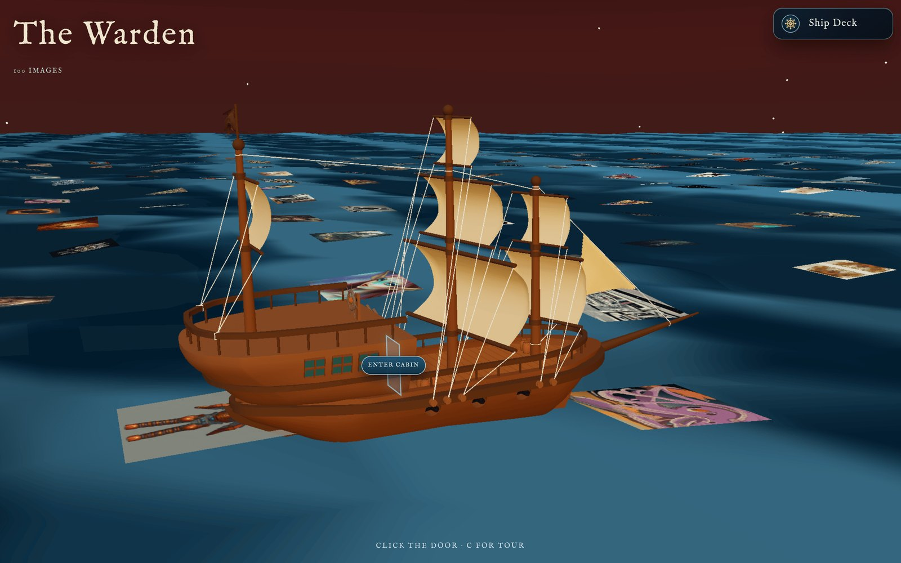

</div>

---

## What this is

You drop a ZIP of paintings onto the deck of a ship called **The Warden**. The
archive is stored, embedded and analysed by four background pipelines — F1, F2,
F5 and F6 — and handed back to you as six *places you can walk into*, not six
dashboards. The other two instruments, the creativity currents and the influence
routes, are read out of the F5 map in the browser rather than computed by a
pipeline of their own.

Type *"a stormy sea at night"* and the collection re-forms as a constellation.
Open the logbook and an unnamed canvas gets a style, a genre and an artist.
Spread the chart table and five centuries of painting lay themselves out by
visual kinship. Every result is precomputed and stored on your machine, and
reachable from a cinematic voyage that never blocks while the pipelines run. The
model weights are fetched once from the Hugging Face Hub; after that nothing
leaves the machine.

This is the software half of a bachelor's thesis at the University of Ljubljana,
Faculty of Computer and Information Science. The full write-up (in Slovene) is
in **[docs/thesis.pdf](docs/thesis.pdf)**.

---

## The six instruments

<table>
<tr>
<td width="50%" valign="top">

### 🔭 F1 · Star Atlas
**Semantic search.** A natural-language query embeds through CLIP; the
collection re-forms as a constellation where the most relevant works are
brightest, largest and most central. Falls back to a local lexical ranking if
the backend is down, so the scene never dies.

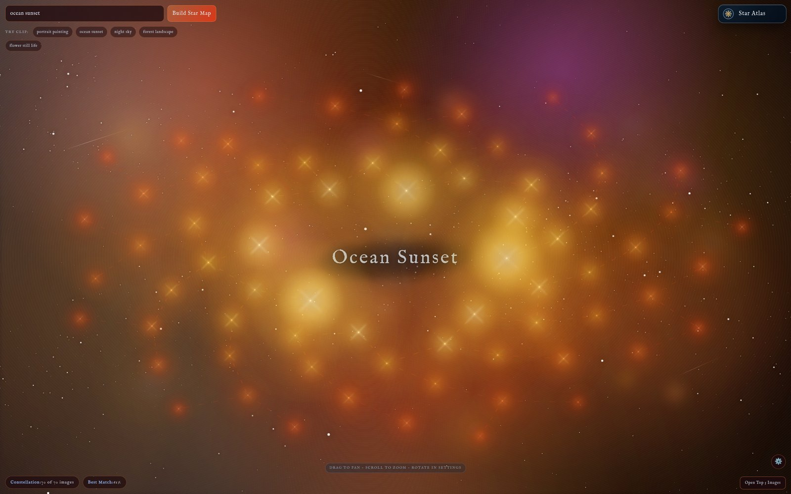

</td>
<td width="50%" valign="top">

### 📖 F2 · Logbook
**Style / genre / artist classification.** Every canvas that arrives without a
proper name gets a page: 27 styles, 10 genres, top-25 artists, each with a
confidence band and art-historical "echoes" of the near-miss classes.

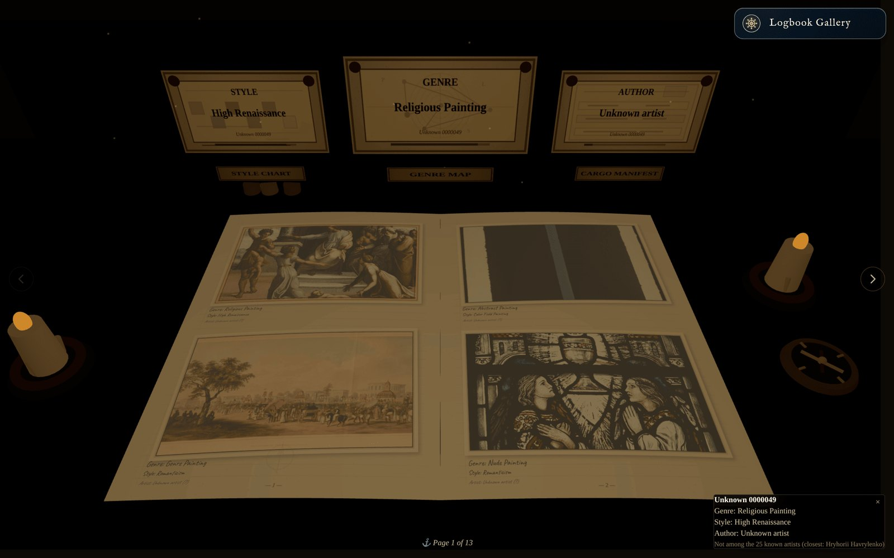

</td>
</tr>
<tr>
<td width="50%" valign="top">

### 🌊 F3 · Creativity Currents
**Originality over time.** Each work gets a creativity reading decomposed into
colour, composition and subject, plotted along the archive's chronology —
derived client-side from the F5 map.

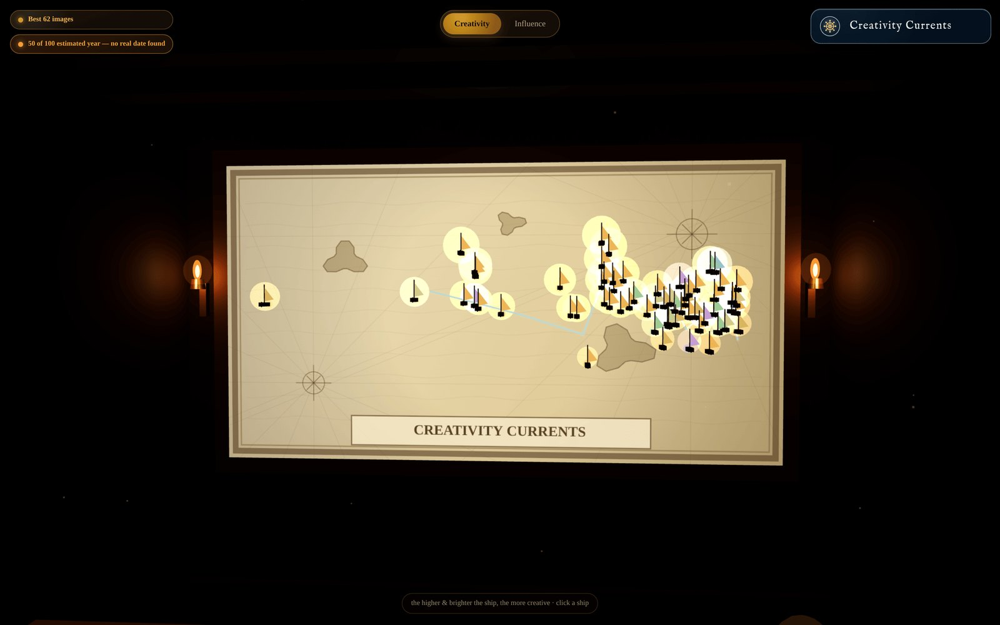

</td>
<td width="50%" valign="top">

### 🧭 F4 · Influence Routes
**Directed visual lineage.** Time-directed links between visually similar works
(older → newer), with the supporting artwork pairs shown side by side — read out
of the F5 map in the browser, like F3.

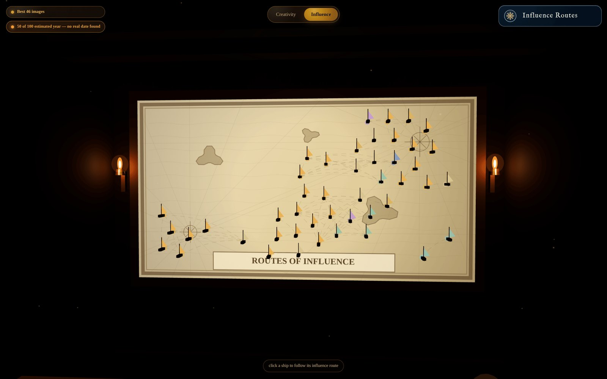

</td>
</tr>
<tr>
<td width="50%" valign="top">

### 🗺️ F5 · Chart Table
**The map of art history.** CLIP embeddings → PCA → clustering → nearest-
neighbour linking. Undated works are dated by a trained year head before they
take their place on the timeline.

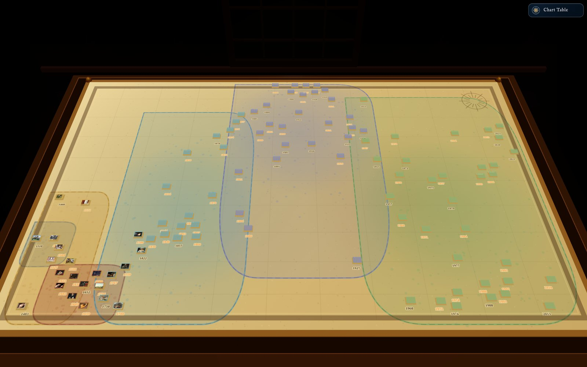

</td>
<td width="50%" valign="top">

### 🕯️ F6 · Captain's Quarters
**Four classical-CV filters.** A lay figure (MediaPipe pose), a dye board
(k-means HSL), a line board (Canny + Hough) and a carved head (RetinaFace
landmarks) — plus a globe for origin. Filters compose; nothing infers at view
time.

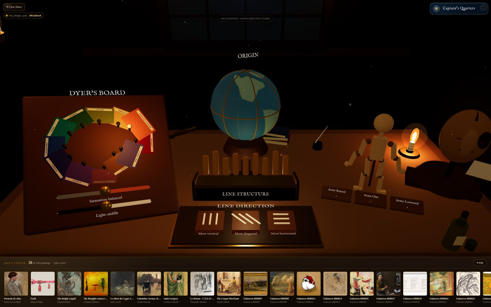

</td>
</tr>
</table>

<details>
<summary><b>The rest of the voyage</b> — deck, chest room, hallway, island</summary>
<br>

| | |
|---|---|
| 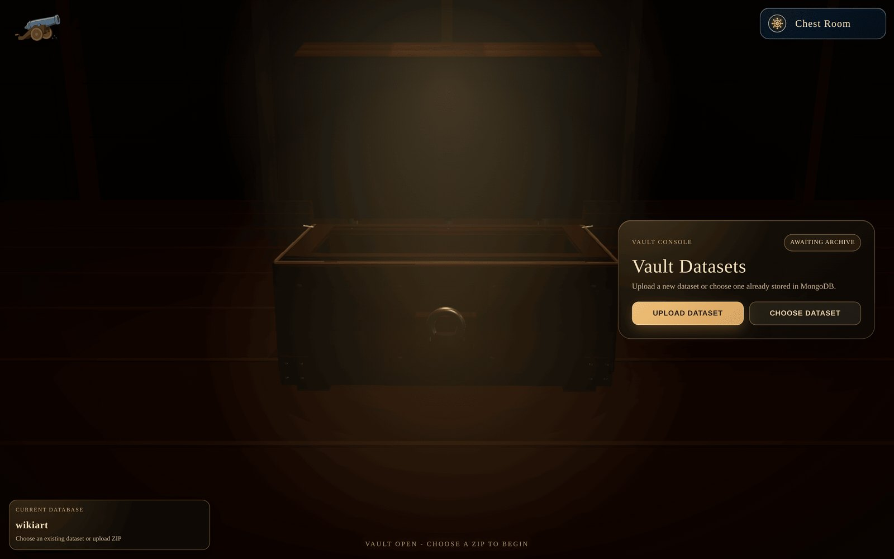<br>**Chest room** — drop a ZIP archive into the chest to load a collection. | 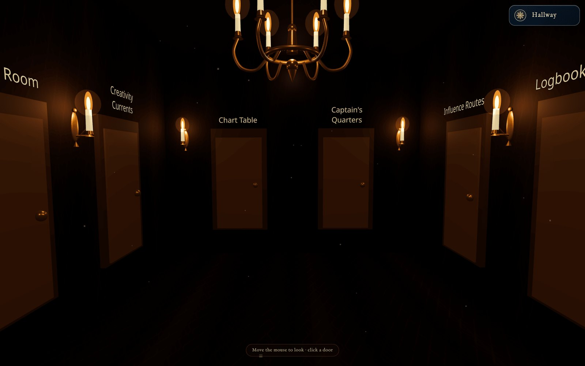<br>**Hallway** — the hub the six instruments hang off. |
| 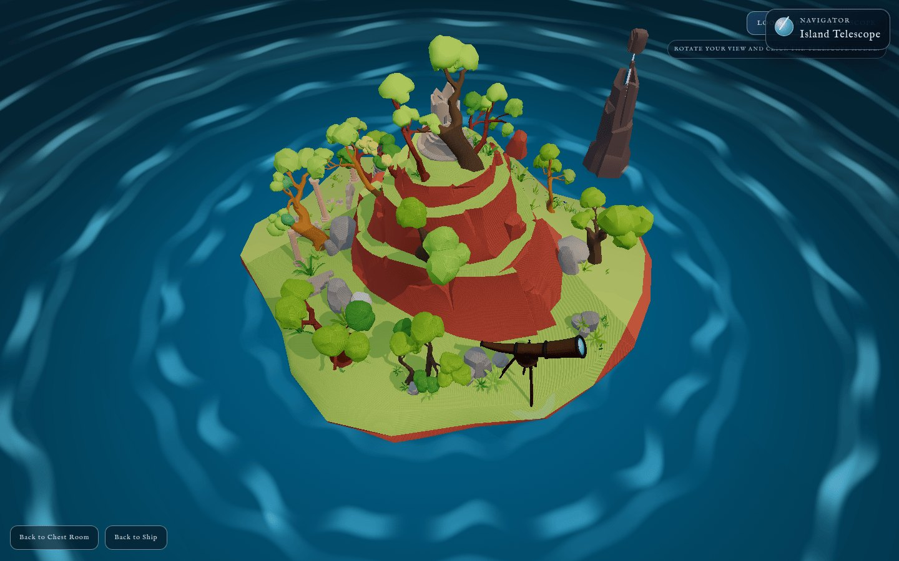<br>**Island** — the telescope that opens the Star Atlas. | <br>**Deck** — the sea of images the voyage starts on. |

</details>

---

## Measured results

Every model was evaluated on the same **12,680-image held-out test set**
(artist-disjoint splits, seed 42). Raw artifacts are in
[`docs/evaluation/`](docs/evaluation/); the analysis is in
[`docs/model-evaluation.md`](docs/model-evaluation.md).

### Style / genre / artist classification (F2)

| Model | Style (27 cls) | Genre (10 cls) | Artist (top-25) |
|---|---:|---:|---:|
| CLIP ViT-B/32, zero-shot *(baseline)* | 25.8 % | 57.7 % | 56.0 % |
| Fine-tuned multi-task ViT-B/16 @224 | 68.1 % | 83.7 % | 94.5 % |
| **Fine-tuned multi-task ViT-L/14 @336** | **77.0 %** | **86.3 %** | **97.3 %** |

### Adapting the retrieval stack to the art domain

| Task | Before | After | Method |
|---|---:|---:|---|
| Zero-shot style accuracy | 25.8 % | **55.3 %** | contrastive CLIP fine-tuning |
| Zero-shot genre accuracy | 57.7 % | **79.8 %** | contrastive CLIP fine-tuning |
| Style retrieval, precision@1 | 41.6 % | **61.0 %** | ArcFace metric embedding |

### Dating an undated painting (F5 year head)

| Metric | Value |
|---|---:|
| Mean absolute error (test, n = 12,239) | **31.2 years** |
| Naive baseline (predict the median year) | 73.5 years |
| Median absolute error | 18.8 years |
| Within 50 years | 85.1 % |

---

## How it fits together

<div align="center">
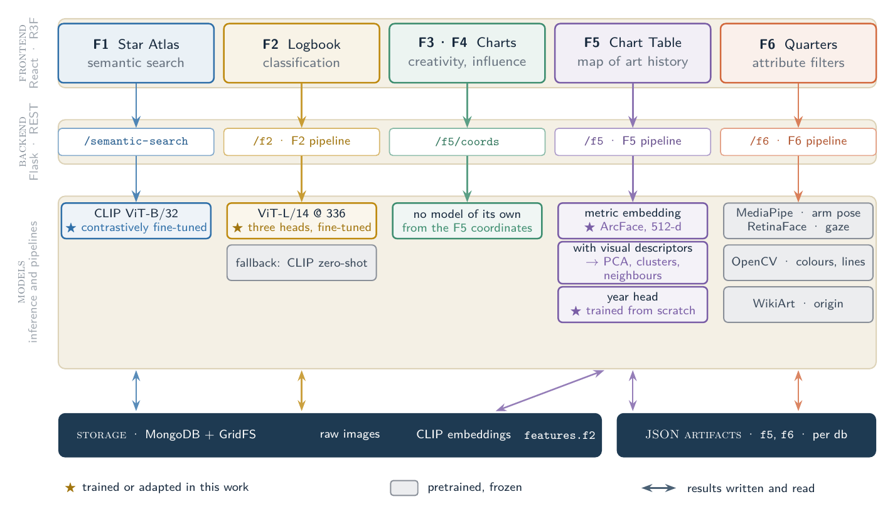
</div>

Each column follows one feature from its scene, through the backend route that
serves it, down to the models that produce the answer, and the storage it is
written to. A star marks a model trained or adapted for this work; grey boxes
are pretrained and frozen.

<div align="center">
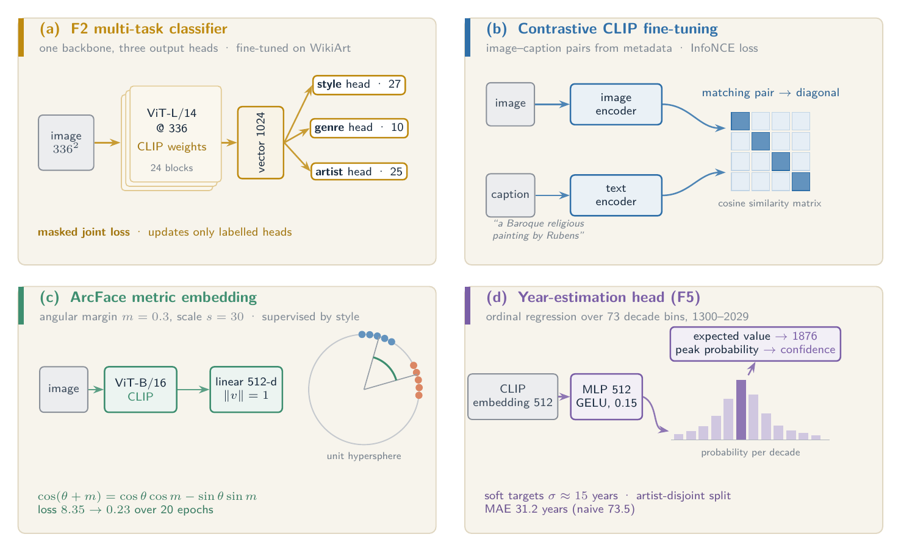
</div>

The four models that were trained or adapted here, drawn in the shape they were
trained in. Both figures come from the thesis; their TikZ source is in
[`docs/diagrams/`](docs/diagrams/).

---

## Quick start

**Prerequisites** — Python 3.12, Node.js 20.19+ or 22.12+ (Vite 8's own floor),
and a MongoDB you can reach. The desktop build and CI both use Python 3.12 and
Node 22; that is the combination this is tested on.

```bash
git clone https://github.com/MB37860/Warden-Ship.git
cd Warden-Ship
cp .env.example .env          # defaults work out of the box
```

<table>
<tr><th>1 · Database</th><th>2 · Backend</th><th>3 · Frontend</th></tr>
<tr valign="top">
<td>

```bash
docker run -d -p 27017:27017 \
  --name mongodb mongo:latest
```

</td>
<td>

```bash
python -m venv .venv
.venv/bin/pip install \
  -r backend/requirements.txt
.venv/bin/python backend/app.py
```

</td>
<td>

```bash
cd frontend
npm ci
npm run dev
```

</td>
</tr>
</table>

Open the URL Vite prints (usually `http://localhost:5173`), drop a ZIP of
images into the chest, pick which pipelines to run, and start walking.

> [!NOTE]
> First run downloads CLIP weights from Hugging Face (~600 MB). Everything
> after that is local.

> [!IMPORTANT]
> **What ships and what doesn't.** The F5 year head (1.2 MB) is committed, so
> dating works out of the box. The fine-tuned F2 classifier and the art-tuned
> CLIP/ArcFace checkpoints are multi-gigabyte and are *not* in this repository —
> without them F2 falls back to CLIP zero-shot (the 25.8 % / 57.7 % / 56.0 %
> row above) and F1 uses stock CLIP. Train and export them with the jobs in
> [`backend/training/`](backend/training/), then point `F2_MODEL_PATH` and
> `CLIP_MODEL_PATH` at the results. `GET /api/f2/health` tells you which model
> is actually loaded.

**Checks:**

```bash
cd frontend && npm run test:run && npm run lint   # 53 tests, eslint clean
cd frontend && npm run build                      # production bundle
```

---

## Desktop app

Prebuilt installers for **Windows and Linux** are on the
[releases page](https://github.com/MB37860/Warden-Ship/releases). Each one
bundles a portable Python runtime and its own MongoDB — no system Python, no
system database, nothing to install alongside it.

To build one yourself:

```bash
cd frontend
npm run electron:dev      # dev: Vite + Electron together
npm run electron:build    # package into frontend/release/
```

CI builds both platforms on every version tag — see
[`.github/workflows/build-desktop.yml`](.github/workflows/build-desktop.yml).
Native ML wheels can't be cross-compiled, so each OS builds on its own runner.

**Where the models come from.** The year head (1.2 MB) is committed and ships
inside the installer. Everything else is too large to travel with it — past
GitHub's 100 MB limit for git, and past the 2 GB cap on a release asset once
added to a 1.6 GB installer — so it lives in public Hub repos and is fetched on
first use into `HF_HOME`, which sits inside the app's data directory on a
packaged build so uninstalling takes it along:

| Artifact | Hub repo | Size |
|---|---|---:|
| Art-domain CLIP (F1 search, all embeddings) | [`warden-ship-clip-art`](https://huggingface.co/breskvarmatej/warden-ship-clip-art) | 581 MB |
| ArcFace style embedding (F5 map) | [`warden-ship-f1-embed`](https://huggingface.co/breskvarmatej/warden-ship-f1-embed) | 330 MB |
| Multi-task ViT-L/336 (F2) | [`warden-ship-f2-vitl336`](https://huggingface.co/breskvarmatej/warden-ship-f2-vitl336) | 1.2 GB |
| WikiArt catalogue — artist, title, year, nationality | [`warden-ship-wikiart-meta`](https://huggingface.co/breskvarmatej/warden-ship-wikiart-meta) | 37 MB |

Every one falls back to something weaker rather than failing — base CLIP, visual
descriptors, CLIP zero-shot, and estimated years with no origins on the globe —
so the app is usable before the download and better after it. `GET /api/models`
reports what is present and what each absence costs; the pipeline dialog offers
the download. A checkout with these under `data/` uses those and never touches
the network.

---

<details>
<summary><b>REST API</b> — every endpoint the frontend talks to</summary>

<br>

| Method | Endpoint | Purpose |
|---|---|---|
| `GET` | `/api/health` | identify the process (the desktop shell uses it to avoid double-spawning) |
| `POST` | `/api/image/upload-batch` | upload an archive into a named collection |
| `GET` | `/api/image/images` | list stored artworks |
| `GET` | `/api/image/image/<file_id>` | stream one image out of GridFS |
| `GET` | `/api/image/semantic-search` | **F1** — CLIP text-to-image search |
| `POST` | `/api/f2/classify` | **F2** — style / genre / artist for one image |
| `GET` | `/api/f2/labels` | the label taxonomy the classifier was trained on |
| `GET` | `/api/f5/coords` | **F5** — history-map coordinates for a collection |
| `GET` | `/api/f5/index`, `/api/f5/summary` | the map's manifest and cluster summary |
| `GET` | `/api/f6/index` | **F6** — merged attribute index (pose, colour, hough, portrait) |
| `GET` | `/api/f6/coords`, `/api/f6/summary` | attribute coordinates and channel coverage |
| `GET` | `/api/models/` | which trained artifacts are present, and what each absence costs |
| `POST` | `/api/models/download` | fetch the missing ones from the Hub, in the background |
| `POST` | `/api/pipeline/run` | start F1 / F2 / F5 / F6 in the background |
| `GET` | `/api/pipeline/status` | poll pipeline progress |
| `POST` | `/api/pipeline/cancel` | cancel a running pipeline |
| `GET` | `/api/database/list`, `/create`, `/delete/<name>` | manage collections |

Every feature endpoint takes `?db_name=<collection>`; output is scoped per
collection on disk.

</details>

<details>
<summary><b>Repository layout</b></summary>

<br>

```
Warden-Ship/
├── backend/                     Flask API + ML pipelines
│   ├── app.py                   dev entry point  ·  electron_server.py for the desktop shell
│   ├── api/                     blueprints: image, database, f2, f6, pipeline, models · clip_service
│   ├── f1_search/               CLIP index builders
│   ├── f2_classification/       runtime classifier (TorchScript → CLIP zero-shot → fallback)
│   ├── f5_history_map/          history-map pipeline, year head, /api/f5
│   ├── f6_attributes/           the four CV channels + the unified index
│   └── training/                offline / SLURM jobs, one directory per model
├── frontend/                    Vite + React 19 + React Three Fiber, Electron shell
│   ├── src/components/scenes/   the 3D environments
│   ├── src/components/features/ f1 … f6
│   ├── src/api/                 every HTTP call in the app
│   └── electron/                desktop main + preload
├── data/f5_year_head/           the one committed model artifact (1.2 MB)
└── docs/                        project site (index.html) · thesis PDF, architecture, evaluation
```

</details>

<details>
<summary><b>Training the models</b></summary>

<br>

Training is offline and cluster-bound; the app only ever reads exported
artifacts. Each job lives in its own directory under `backend/training/` with
its own README and SLURM script:

| Directory | Produces |
|---|---|
| `training/f2_classification/` | the multi-task style/genre/artist ViT (the headline model) |
| `training/f1_clip_finetune/` | art-domain contrastive CLIP |
| `training/f1_embedding/` | the ArcFace style-retrieval embedding |
| `training/f5_year_head/` | the year regressor over CLIP vectors |

Full runbook: [`docs/training-runbook.md`](docs/training-runbook.md).

</details>

---

## Documentation

| Document | What it covers |
|---|---|
| [docs/thesis.pdf](docs/thesis.pdf) | the complete thesis (Slovene, with English abstract) |
| [docs/concept-and-frontend.md](docs/concept-and-frontend.md) | the idea, the voyage, every scene and element |
| [docs/backend-architecture.md](docs/backend-architecture.md) | Flask service, data layer, pipeline runner, all endpoints |
| [docs/features.md](docs/features.md) | F1–F6 element by element, with the model behind each |
| [docs/model-evaluation.md](docs/model-evaluation.md) | how the numbers above were measured, per-class breakdowns |
| [docs/training-runbook.md](docs/training-runbook.md) | upload → submit → monitor → export → wire in |
| [docs/backend-pregled-SL.md](docs/backend-pregled-SL.md) | slovenski pregled zaledja in modelov |
| [docs/file-naming.md](docs/file-naming.md) | how artist and title are recovered from a filename |

---

## A note on how this was built

Large parts of this codebase were written **with the help of AI coding
assistants** (Claude), used as a pair programmer throughout: scaffolding
components, drafting pipelines, refactoring, and writing tests. Every
architectural decision, every model choice, all training and evaluation runs,
and the review of what actually landed are the author's own — as is the
responsibility for the result.

The numbers reported above come from real evaluation runs on a held-out test
set, not from a model's estimate; the raw artifacts are committed in
[`docs/evaluation/`](docs/evaluation/) so anyone can check them.

---

## Credits

- **Dataset** — [WikiArt](https://www.wikiart.org/), via the WikiArt parquet distribution, for training and evaluation.
- **AGIQA-3K** — the AI-generated images drifting on the sea in the deck scene come from the AGIQA-3K dataset; they are the one place in the app where machine-made imagery appears, deliberately, as the thing the ship is a warden *against*.
- **Models** — OpenAI CLIP, Google MediaPipe, RetinaFace, OpenCV, PyTorch, Hugging Face Transformers.
- **3D assets** — the `.glb` models in `frontend/src/assets/models/` are third-party assets used under their respective terms.

**Author** — Matej Breskvar
**Supervisors** — prof. dr. Narvika Bovcon, doc. dr. Blaž Meden
University of Ljubljana, Faculty of Computer and Information Science, 2025/26

Source code is MIT licensed — see [LICENSE](LICENSE) for the third-party asset carve-outs.
